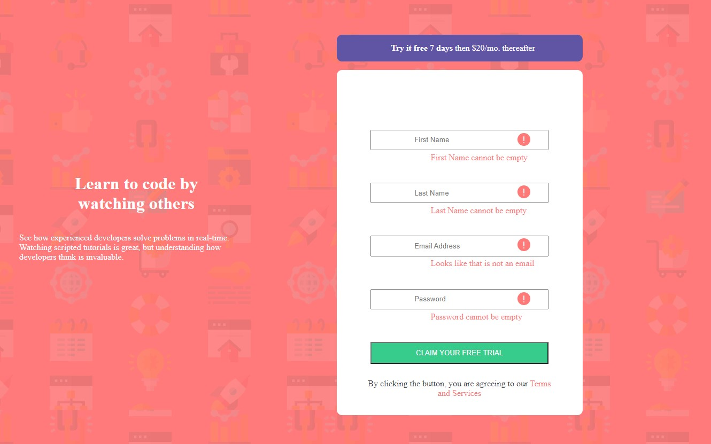

# Frontend Mentor - Intro component with sign up form solution

This is a solution to the [Intro component with sign up form challenge on Frontend Mentor](https://www.frontendmentor.io/challenges/intro-component-with-signup-form-5cf91bd49edda32581d28fd1). Frontend Mentor challenges help you improve your coding skills by building realistic projects. 

## Table of contents

- [Overview](#overview)
  - [The challenge](#the-challenge)
  - [Screenshot](#screenshot)
  - [Links](#links)
  - [Built with](#built-with)
  - [What I learned](#what-i-learned)
- [Author](#author)
## Overview

### The challenge

Users should be able to:

- View the optimal layout for the site depending on their device's screen size
- See hover states for all interactive elements on the page
- Receive an error message when the `form` is submitted if:
  - Any `input` field is empty. The message for this error should say *"[Field Name] cannot be empty"*
  - The email address is not formatted correctly (i.e. a correct email address should have this structure: `name@host.tld`). The message for this error should say *"Looks like this is not an email"*

### Screenshot

### Links

- Solution URL: [GitHub Repository](https://github.com/DarkPhoenixNinja92/Intro-Comp-With-Signup-Form)
- Live Site URL: [Live Site](https://darkphoenixninja92.github.io/Intro-Comp-With-Signup-Form)

### Built with

- Semantic HTML5 markup
- CSS custom properties
- Flexbox
- JavaScript Custom Properties

### What I learned

This project gave me an opportunity to explore email validation and regex - two things that I had not really delved into beyond the odd tutorial thus far. It also gave me experience asking questions and getting help solving basic issues as I ended up creating a bug where my error message was not going away when the email was correct as it should have done.

## Author

- Website - [Shaun Pour](https://shaunpourdev.com)
- Frontend Mentor - [@DarkPhoenixNinja92](https://www.frontendmentor.io/profile/DarkPhoenixNinja92)
- GitHub - [DarkPhoenixNinja92](https://github.com/DarkPhoenixNinja92)